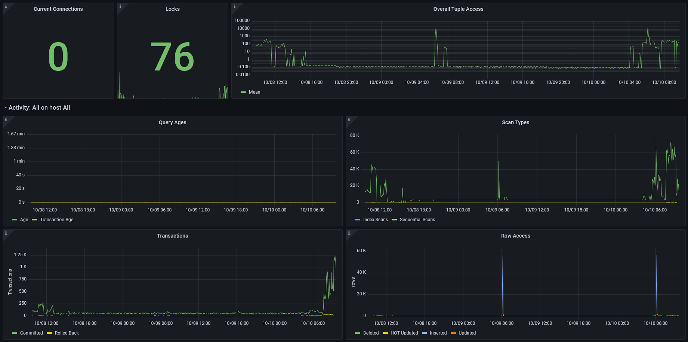
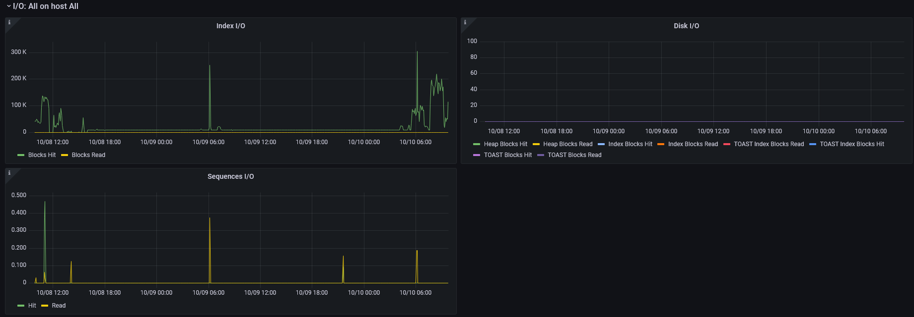

pgflux
======

A simple Python utility to send PostgreSQL metrics to InfluxDB

It enables Grafana Visualisations as seen in the screenshots below:

.. image:: images/grafana-dashboard-02.png
  :target: _images/grafana-dashboard-02.png

Installation
============

The project can be installed directly via ``pip``::

    python3 -m venv /path/to/virtual-env
    /path/to/virtual-env/bin/pip install pgflux

The use of a virtual environment is optional, but recommended.

Documents
---------

.. toctree::
    :maxdepth: 1

    installation
    usage
    queries
    dbselection
    grafana-dashboard
    development
    API <api/pgflux>

Indices and tables
==================

* :ref:`genindex`
* :ref:`modindex`
* :ref:`search`
