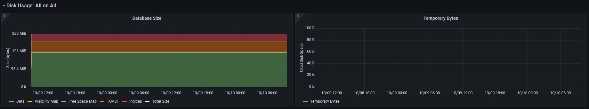

pgflux
======

A simple Python utility to send PostgreSQL metrics to InfluxDB

It enables Grafana Visualisations as seen in the screenshots below:

.. image:: images/grafana-dashboard-01.png
  :target: _images/grafana-dashboard-01.png

.. image:: images/grafana-dashboard-03.png
  :target: _images/grafana-dashboard-03.png

Documents
---------

.. toctree::
    :maxdepth: 1

    api/pgflux

Indices and tables
==================

* :ref:`genindex`
* :ref:`modindex`
* :ref:`search`
